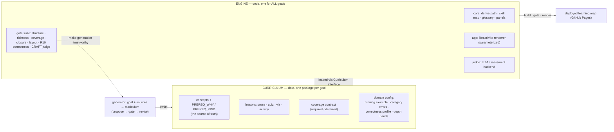
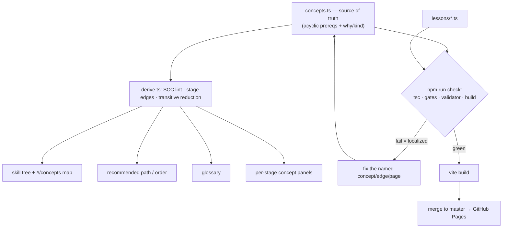
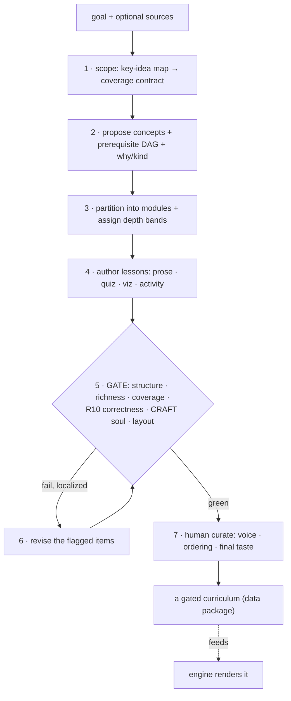
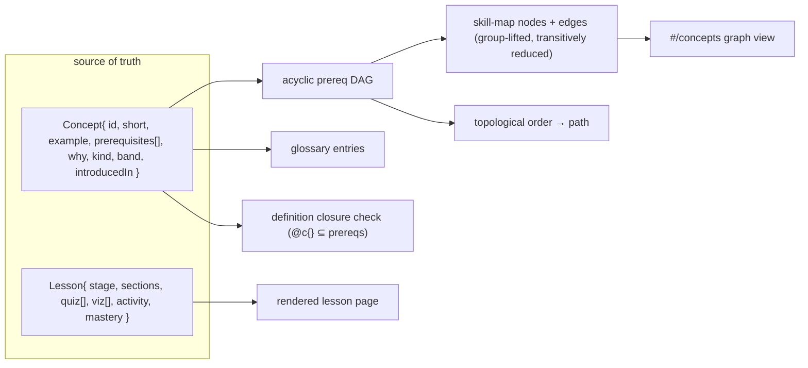

# Diagrams — process & data flow for the Ladder engine

Mermaid (renders on GitHub). Companion to `ENGINE.md` (architecture prose) and `GAPS.md`
(what's built vs. designed). **Status reminder:** the engine/curriculum split and the
generator are *designed, not built* — these diagrams show the **target** flow; today the
"engine" code and one curriculum are fused in `src/content/*` (see `GAPS.md` §B).

---

## 1. Architecture — engine (code) vs curriculum (data) vs generator

*Today:* `CURRICULUM` and `ENGINE` are not separated — `src/content/*` is both. `GEN` does
not exist. The **CRAFT judge** in `GATES` is designed (`GAPS.md` A1), not built.

---

## 2. Build / derive / gate pipeline (what exists today, deterministic)

*Gap (`GAPS.md` A6):* the gate does **not** yet validate lesson-prereq ordering or
lesson-prose `@c{}` stage — a reorder can silently introduce a forward reference.

---

## 3. The generator loop — the moonshot (designed, `ENGINE.md` §5 / `GAPS.md` B2)

**Division of labor (the standing rule):** *programmatic* for coverage + enforcement
(gates), *agents* for generation + judgment (steps 2/4/6 + the R10 & craft judges),
*human* for direction + taste (step 7). Steps 5–6 are why the loop can run autonomously
without shipping garbage — **but only as strong as the gates** (so `GAPS.md` A1/A2/B3 gate
the trust).

---

## 4. Curriculum data model (one source of truth → many derived views)

*Rule:* edit the **source of truth**; never hand-edit a derived view (the gates enforce
derived-not-drifted).
